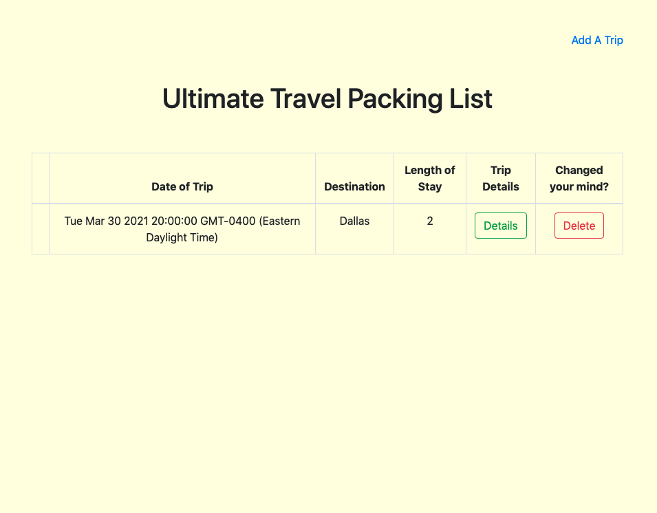
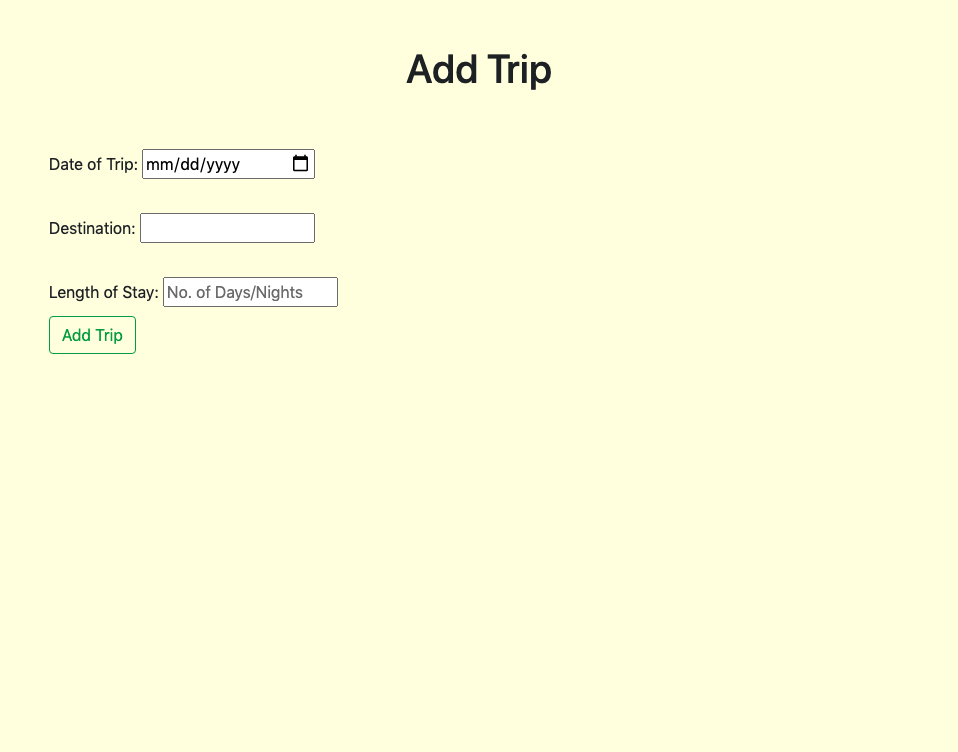
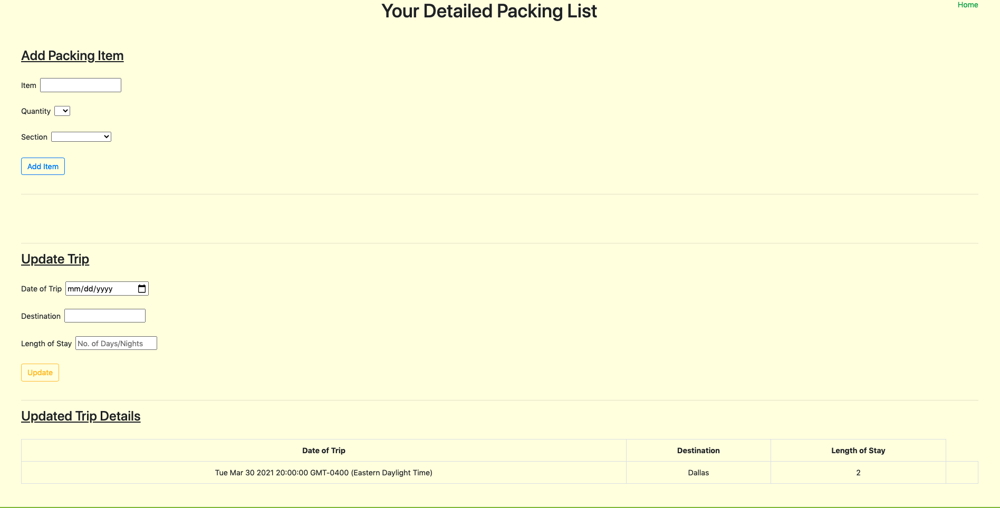
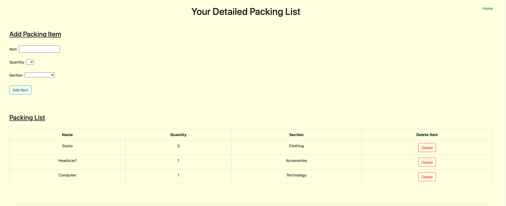
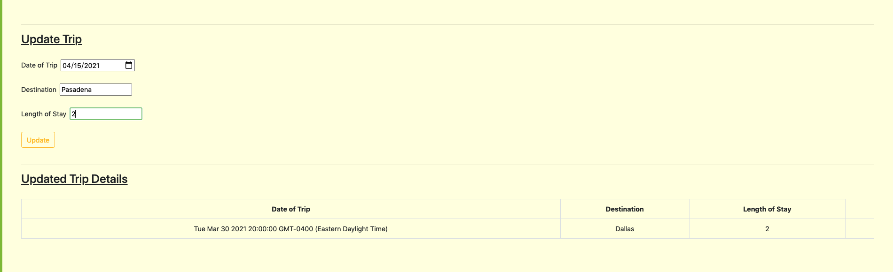
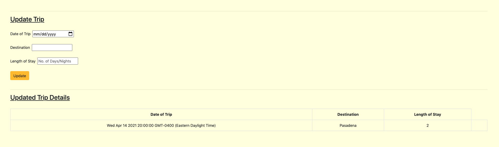

# Ultimate Travel Packing List 

For the second project in the course, we were paired up to create a simple full-stack application utilizing the technologies. Our application is a travel checklist app designed to create the "ultimate travel packing list" for travelers to ensure they pack everything they need to make their trip as enjoyable as possible.

#### Link for app:

## Screenshots

## Technologies Used

In this project, we used HTML, Bootstrap, CSS, Javascript, MongoDB, Node, and Express JS. 

## Next Steps
- Suggested items to pack based on the season in desired locale 
- Weather forecast for desired locale
- Ability to create and save an "essential checklist" with all the user's basic travel necessities 
- Continued work on design and aesthetic of app